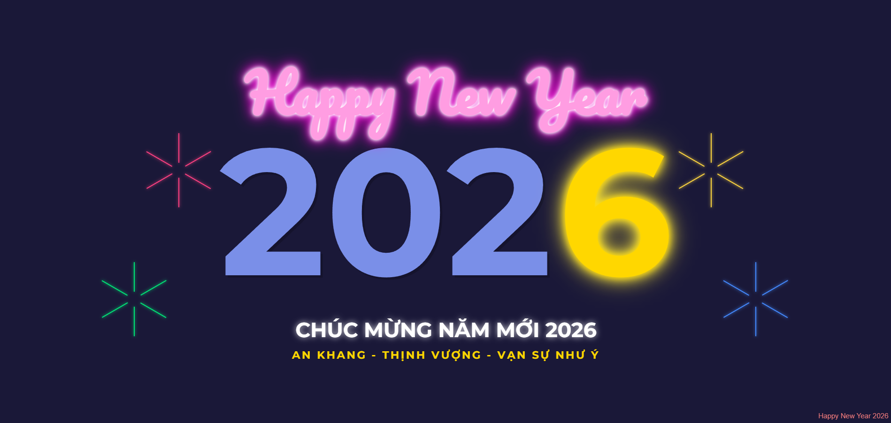

# Happy New Year 2026 - Neon Party

A visually stunning, pure CSS animated webpage with vibrant neon effects celebrating the New Year 2026. Features animated text, fireworks, and background music for a festive party atmosphere.



## Features

- **Animated Greeting** - "Happy New Year" text with glowing neon effects
- **Year Display Animation** - Smooth animated transition showing "2026" with golden glow
- **Fireworks Effect** - Colorful celebratory fireworks bursting across the screen in pink, green, gold, and blue
- **Vietnamese Wishes** - Festive New Year wishes in Vietnamese: "Chúc mừng năm mới 2026" with messages of health, prosperity, and happiness
- **Background Music** - Celebratory background audio that plays automatically
- **Neon Glow Effects** - Vibrant text shadows and glowing neon styling
- **Pure CSS Animations** - All animations built with CSS keyframes and transitions
- **Fully Responsive** - Adapts beautifully to different screen sizes and orientations
- **Google Fonts** - Uses Montserrat and Pacifico fonts for stylish typography

## Technologies

- HTML5 (Vietnamese language support)
- CSS3 (Animations, Keyframes, Flexbox, Neon Effects)
- Vanilla JavaScript (Audio autoplay handling)

## How to Use

Simply open `index.html` in any modern web browser to view the animation:

```bash
open index.html
```

Or double-click the `index.html` file in your file explorer.

## Browser Support

Works best in modern browsers that support:
- CSS Animations and Keyframes
- CSS Flexbox
- HTML5 Audio
- CSS Text-shadow Effects

## Project Structure

```
├── index.html        # Main HTML file with layout and audio element
├── style.css         # Complete styling and animations
├── README.md         # This file
└── LICENSE           # MIT License
```

## Animation Timeline

1. **0.5s** - "Happy New Year" text fades in with neon glow
2. **0.5s** - Year "2026" displays with scale animation
3. **1.0s** - Fireworks begin bursting at multiple locations
4. **2.0s** - Vietnamese wishes fade in from bottom

## License

This project is licensed under the MIT License - see the [LICENSE](LICENSE) file for details.
